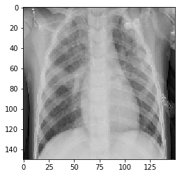
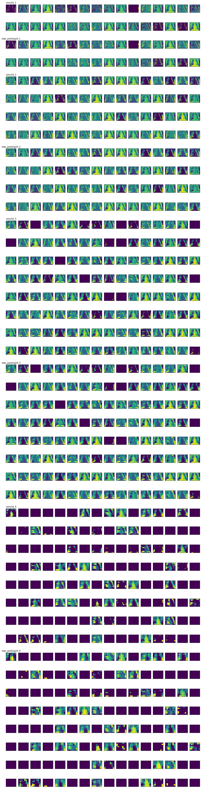

## Visualizing Activation Functions - Lab

## Introduction

Now that you've built your own CNN and seen how to visualize feature maps, its time to practice loading a pretrained model from file and practice visualizing the learned features systematically. In this lab, you'll expand upon the code from the previous lesson in order to succinctly visualize all the channels from each layer in a CNN.

## Objectives

You will be able to:

* Load a saved model
    * makes it easier to share
    * trained/has weights
    * summary and learn about your model
* Visualize the filters produced by hidden layers in a CNN
    * What dictates the number of images created in a layer?
        * Number of nodes
    * Iterate through your layters using the load_model library

## Load a Model  

For this lab, we have saved a model **chest_xray_all_with_augmentation_data.h5**.  
This saved file includes both the model architecture and the trained weights. See the `model.save()` method for further details. The model was built in order to help identify patients with pneumonia. Start simply by loading the model and pulling up a summary of the layers. (To load the model use the `keras.models.load_model` method.) 


```python
#Your code here
from keras.models import load_model
model = load_model('chest_xray_all_with_augmentation_data.h5')
model.summary()
```

    _________________________________________________________________
    Layer (type)                 Output Shape              Param #   
    =================================================================
    conv2d_1 (Conv2D)            (None, 148, 148, 32)      896       
    _________________________________________________________________
    max_pooling2d_1 (MaxPooling2 (None, 74, 74, 32)        0         
    _________________________________________________________________
    conv2d_2 (Conv2D)            (None, 72, 72, 64)        18496     
    _________________________________________________________________
    max_pooling2d_2 (MaxPooling2 (None, 36, 36, 64)        0         
    _________________________________________________________________
    conv2d_3 (Conv2D)            (None, 34, 34, 128)       73856     
    _________________________________________________________________
    max_pooling2d_3 (MaxPooling2 (None, 17, 17, 128)       0         
    _________________________________________________________________
    conv2d_4 (Conv2D)            (None, 15, 15, 128)       147584    
    _________________________________________________________________
    max_pooling2d_4 (MaxPooling2 (None, 7, 7, 128)         0         
    _________________________________________________________________
    flatten_1 (Flatten)          (None, 6272)              0         
    _________________________________________________________________
    dense_1 (Dense)              (None, 512)               3211776   
    _________________________________________________________________
    dense_2 (Dense)              (None, 1)                 513       
    =================================================================
    Total params: 3,453,121
    Trainable params: 3,453,121
    Non-trainable params: 0
    _________________________________________________________________


## Load an Image

Before we plot the learned representations of the convolutional base, let's import an image and display it prior to processing. This will provide us a comparison to the transformations formed by the model's feature maps.   

Load and display the image **person3_virus_16.jpeg**.


```python
#Your code here
from keras.preprocessing import image
import matplotlib.image as mpimg
import matplotlib.pyplot as plt
%matplotlib inline

filename = 'person3_virus_16.jpeg'
img = image.load_img(filename, target_size=(150, 150))
plt.imshow(img)
plt.show()
```





## Transform the Image to a Tensor and Visualize Again

Recall that we will always preprocess our images into tensors when using deep learning. As such, preprocess this image and then redisplay the tensor.


```python
#Your code here
import numpy as np

img_tensor = image.img_to_array(img)
img_tensor = np.expand_dims(img_tensor, axis=0)

#Follow the Original Model Preprocessing
img_tensor /= 255. # why divide by 255? Normalizes it

#0 - 255 /255 -> 0 and 1

#Check tensor shape
print(img_tensor.shape)

#Preview an image
plt.imshow(img_tensor[0])
plt.show()
```

    (1, 150, 150, 3)


## Plot Feature Maps

Now that we've loaded a model, practice visualizing each of the channels for each of feature maps of the convolutional layers. Recall that this process will take a few steps. First, extract the feature maps, or layer outputs from each of the activation functions in the model. From there, generate models that transform the image from its raw state to these feature maps. From there, you can then take these transformations and visualize each channel for each feature map.  

To preview the results of our solution code, take a sneek peak at the Intermediate_Activations_Visualized.pdf file.


```python
model.layers[2].name
```


    'conv2d_2'


```python
for a in activations:
    print(a.shape)
    aa = a[0][0][0]
    print(aa)
    print(((aa - aa.mean())/aa.std())*64 + 128)
    break
```

    (1, 148, 148, 32)
    [112.028885 140.60341   40.497643  45.86606  128.96552  101.94648
     160.86565   88.39211   37.847816  36.680244 119.63902   92.57716
      21.688644  42.99106  163.71036  138.22508   33.15107   40.948227
      28.43      36.668602  43.056847 129.33823   41.207085 133.29005
      40.800117  53.88736   75.34276  139.79459  101.39128   51.58864
     106.96156   42.949905]
    [173.67303  214.8757    70.529495  78.27041  198.0946   159.13484
     244.09258  139.5903    66.70861   65.02504  184.64638  145.62488
      43.408104  74.12484  248.19447  211.44632   59.936195  71.17921
      53.128716  65.008255  74.2197   198.63202   71.55246  204.3303
      70.96564   89.836624 120.77396  213.70944  158.33429   86.52201
     166.36629   74.065506]


```python
#Your code here
from keras import models
import math #used for determining the number of rows in our figure below

# Extract model layer outputs
layer_outputs = [layer.output for layer in model.layers[:8]]

# Create a model for displaying the feature maps
activation_model = models.Model(inputs=model.input, outputs=layer_outputs)

activations = activation_model.predict(img_tensor)

#Extract Layer Names for Labelling
layer_names = []
for layer in model.layers[:8]:
    layer_names.append(layer.name)

total_features = sum([a.shape[-1] for a in activations])
total_features

n_columns = 16
n_rows = math.ceil(total_features / n_columns)


iteration = 0
fig , axes = plt.subplots(nrows=n_rows, ncols=n_columns, figsize=(n_cols, n_rows*1.5))

for layer_n, layer_activation in enumerate(activations):
    n_channels = layer_activation.shape[-1]
    for ch_idx in range(n_channels):
        row = iteration // n_columns
        column = iteration % n_columns
    
        ax = axes[row, column]
        
        # 
        channel_image = layer_activation[0, :, :, ch_idx]
        # Post-process the feature to make it visually palatable
        channel_image -= channel_image.mean()
        channel_image /= channel_image.std()
        channel_image *= 64
        channel_image += 128
        channel_image = np.clip(channel_image, 0, 255).astype('uint8')

        ax.imshow(channel_image, aspect='auto', cmap='viridis')
        ax.get_xaxis().set_ticks([])
        ax.get_yaxis().set_ticks([])
        
        if ch_idx == 0:
            ax.set_title(layer_names[layer_n], fontsize=10)
        iteration += 1

fig.subplots_adjust(hspace=1.25)
plt.savefig("Intermediate_Activations_Visualized.pdf")
plt.show()
```

    /anaconda3/lib/python3.6/site-packages/ipykernel_launcher.py:41: RuntimeWarning: invalid value encountered in true_divide





## Summary

Nice work! In this lab, you practiced loading a model and then visualizing the activation feature maps learned by that model on your data! In the upcoming labs and sections you will build upon the first part of this and see how you can adapt the representations learned by more experienced models to your own applications which may have limited training data.
